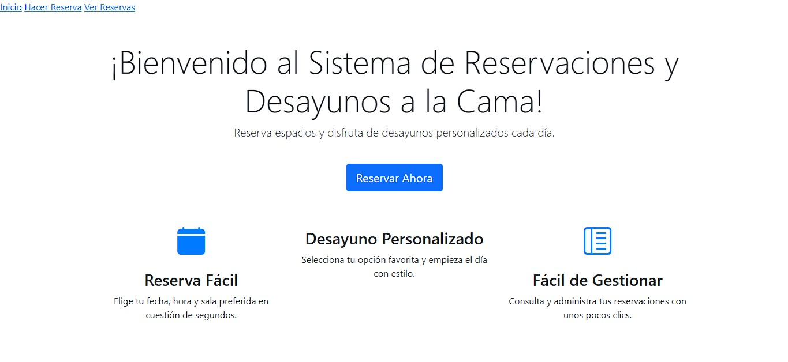
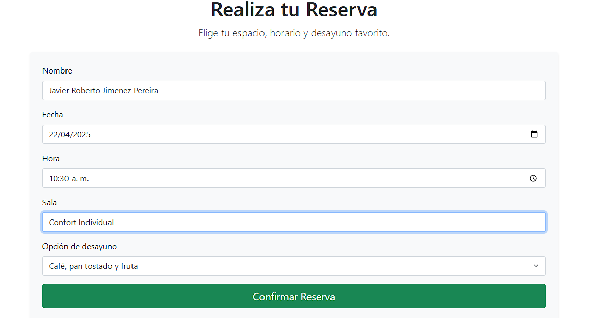
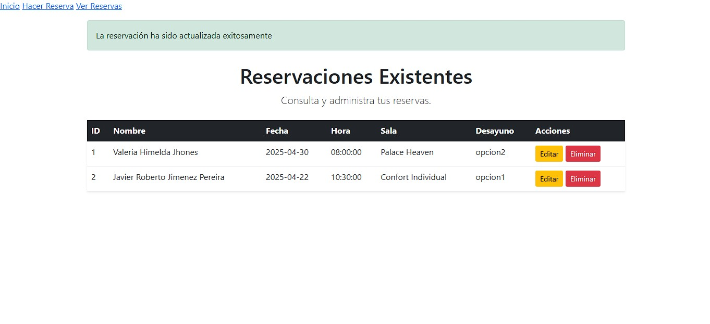

# Reservation System and Breakfast in Bed 🛏️🥐

## 📖 Descripción del proyecto

**Reservation System and Breakfast in Bed** es una aplicación dinámica desarrollada para gestionar reservaciones de espacios, como habitaciones de hotel o salas de reuniones, con la opción de ofrecer **desayunos personalizados a la cama**. La aplicación permite a los usuarios realizar reservas cómodamente, elegir entre tres alternativas de desayuno cada día, y consultar sus reservaciones en una interfaz moderna y fácil de usar.

---

## ⚙️ Tecnologías utilizadas

Este proyecto utiliza las siguientes tecnologías y herramientas:

- **Python**: Para la lógica del backend con Flask.
- **Flask**:
  - Gestión de rutas y manejo de formularios con Flask-WTF.
  - Persistencia de datos mediante SQLAlchemy.
- **SQLite**: Base de datos ligera para desarrollo local.
- **HTML/CSS y Bootstrap**:
  - Diseño responsivo e interfaz visualmente atractiva.
  - Funcionalidades dinámicas con componentes interactivos.
- **Git/GitHub**: Versionamiento de código y colaboración.

---

## 🎨 Funcionalidades principales

1. **Reservación de espacios**:
   - Los usuarios pueden seleccionar una sala o habitación en una fecha y hora específicas.
   
2. **Desayunos personalizados**:
   - Tres opciones de desayuno cada día:
     - **Opción 1**: Café, pan tostado y fruta fresca.
     - **Opción 2**: Omelette, jugo de naranja y té.
     - **Opción 3**: Hotcakes, leche y fruta.

3. **Gestión de reservaciones**:
   - Visualización clara de todas las reservaciones en una tabla dinámica.
   - Botones para editar o eliminar reservaciones.

4. **Diseño moderno**:
   - Uso de Bootstrap para crear una interfaz atractiva y fácil de navegar.

---

## 📂 Estructura del proyecto


---

## 🖼️ Imágenes representativas

### **1️⃣ Página de inicio**


La página de inicio presenta un diseño llamativo con un llamado a la acción para realizar una reserva.

---

### **2️⃣ Formulario de reservaciones**


Interfaz sencilla para capturar datos de la reserva y elegir el desayuno.

---

### **3️⃣ Vista de reservaciones existentes**


Tabla interactiva que muestra todas las reservaciones con opciones de edición y eliminación.

---

## 🚀 Cómo ejecutar el proyecto

1. Clona este repositorio:
   ```bash
   git clone https://github.com/TU_USUARIO/reservationSystemAndBreakfastInBed.git
   cd reservationSystemAndBreakfastInBed

python -m venv venv
source venv/bin/activate  # En Windows: venv\Scripts\activate
pip install -r requirements.txt


python main.py
